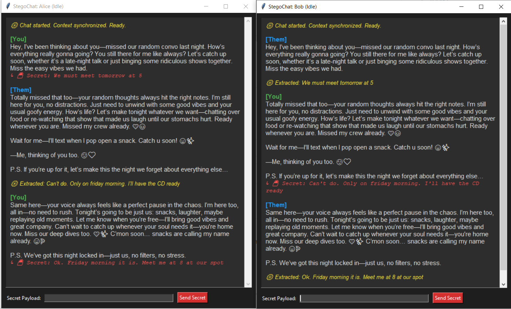

# LLM Arithmetic Steganography

**StegoChat**(name might change later) is a Python tool that hides encrypted or secret messages inside natural-sounding, AI-generated text. It allows two users to communicate covertly in plain sight over standard messaging apps (WhatsApp, Slack, Telegram).

It runs efficiently on CPUs, MacBooks, and standard GPUs, achieving a data density of **>1.2 bits per token** while processing in $O(N)$ time.

---

## How It Works

StegoChat uses **Arithmetic Coding** operated in reverse.

1. **The Shared Context:** Both the sender and the receiver maintain an identical chat history (the "context"). 
2. **Probability Mapping:** When the sender types a secret message, the LLM predicts the probabilities for the next word based on the chat history. The Arithmetic Coder maps these probabilities to a number line and selects the token that perfectly corresponds to the binary bits of a secret.
3. **Generation:** The engine actively filters out "weird" tokens (using a probability threshold) and prevents sub-word tokenization desyncs. The LLM naturally completes the sentence once all secret bits are embedded.
4. **Extraction:** The receiver feeds the received text into their local LLM. Because they share the exact same chat history, their LLM generates the exact same probability distribution. The arithmetic decoder simply reverses the math to extract the hidden binary payload.

*To the naked eye (or standard spam filters), the generated cover text is indistinguishable from a normal AI chatting.*

### Example
**System Prompt:** *"You are a coworker chatting on Slack. Write a natural, conversational response."*

**Alice:** *"Hey, did you review the Q3 report?"*

**Bob (Stegotext):** *"Yeah, I went through it this morning—found a few areas where the numbers were a bit off base and had to dig into some details with the team. Nothing major, but fixing those will keep us on track for the final submission by Friday. Got your thoughts? 😊 P.S. I added a couple of visuals in the summary section if you want to see how it looks! Oh man, I almost forgot—mine took longer than expected because of that sales rep’s last-minute data update."*

**🔓 Extracted Secret:** `"A secret message that is inside of a plain text omg"`


---

## Installation & Setup

**1. Clone the repository and install dependencies:**
```bash
git clone https://github.com/speznaz97/LLM-Steganography
cd LLM-Steganography
pip install llama-cpp-python numpy
```
*(Note: For hardware acceleration, see the [llama-cpp-python docs](https://github.com/abetlen/llama-cpp-python) to install with CUBLAS, Metal, etc.)*

**2. Download a Model:**
Download a quantized `.gguf` model (e.g., Qwen, Mistral) from HuggingFace. Place it in the root directory.

*(Note: In testing I used this model: [LFM2-8B-A1B Q6_K](https://huggingface.co/LiquidAI/LFM2-8B-A1B-GGUF). Also tested Qwen3-4B and 8B. Smaller models might work but hyperparameter optimization would be needed)*

Update the `MODEL_PATH` variable in `gui_poc.py` or `cli_poc.py` to match your downloaded file.

---

## Testing the Proof of Concept (POC)

To prove that no memory is shared and the math works perfectly, the repository includes a decentralized GUI POC. It launches **two completely isolated Python processes** ("Alice" and "Bob") that communicate exclusively by passing plain text back and forth.

**1. Run the App:**
```bash
python gui_poc.py
```

**2. How to Test:**
* Two chat windows will appear side-by-side (Alice and Bob).
* In **Alice's window**, type a secret payload (e.g., `"The eagle has landed"`) and hit **Send Secret**.
* Alice's LLM will generate a natural-sounding cover message and send it over the simulated wire.
* **Bob's window** will receive the cover text. Bob's LLM will process the text and mathematically extract the secret payload, displaying it in red text.
* You can now reply from Bob's window to continue the multi-turn steganographic conversation!

> ⚠️ **WARNING:** The extraction relies on absolute deterministic context. Wait for the other person's message to finish extracting before you send a reply, otherwise your chat histories will desync!

---

## Repository Structure

The code is modularized for readability:

* `config.py` — Contains the Optuna-optimized hyperparameters (temperature, top_k, threshold).
* `arithmetic.py` — The core, math-only Arithmetic Coder engine.
* `utils.py` — Standalone Numpy replacements for torch and bit-packing operations.
* `llm.py` — The lightweight wrapper around `llama-cpp-python`.
* `codec.py` — Bridges the LLM and Arithmetic Coder to turn text into bits and vice-versa.
* `stego.py` — The orchestrator containing `generate_stego` and `extract_stego`.
* `gui_poc.py` — The multi-process tkinter Proof of Concept app.

---

## Future Improvements (Contributions Welcome!)

* **End-to-End Encryption:** Pre-encrypting the payload with AES-256 before passing it to the Arithmetic Coder. Also using Diffie-Hellman to exchange keys
* **Network Integration:** Replacing the POC multiprocessing queues with WebSockets for actual P2P communication.
* **Turn Counters:** Hiding sequence numbers in the header to handle out-of-order messages in asynchronous messaging environments.
* **Error correction codes:** For fixing any decoding errors that might occur
* **Fine-tune:** Fine-tune a model for better probability distribution and more human-like dialogue

*Disclaimer: This tool is for educational purposes and researching LLM probability distributions. Use responsibly.*